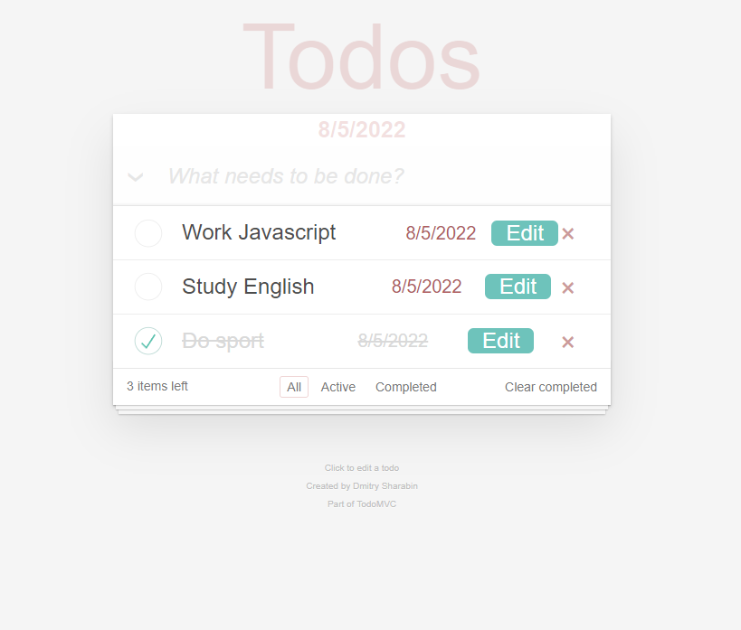

# Patika.dev - React Todo App

This project is the 2nd assignment in the fronted path react lessons on the [patika](https://app.patika.dev/) platform, Todo App application.

## Features

- Adding a new todo
- Edit todo
- Todo completion
- Delete a Todo
- Clear all Todos
- Todos filtering

## Run it on your computer

Clone the project

```bash
  git clone https://github.com/RasulSonmez/todo-app-reactjs-patikadev.git
```

Go to the project directory

```bash
  cd todo-app-reactjs-patikadev
```

Install required packages

```bash
  npm install
```

Run the server

```bash
  npm run start
```

## Screenshots


